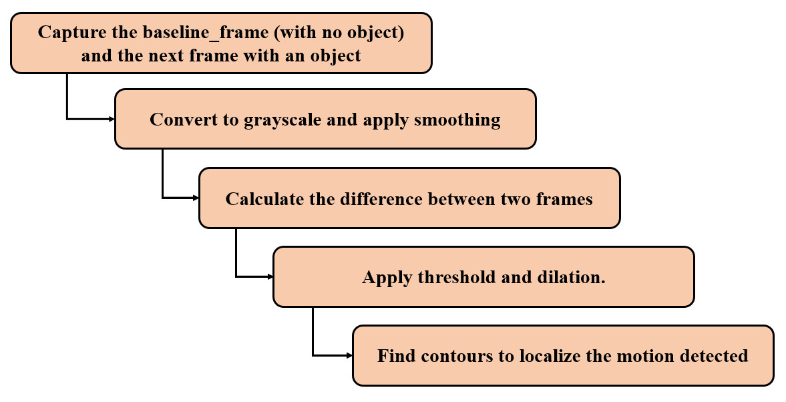
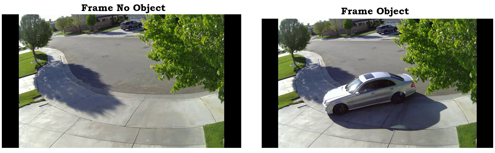
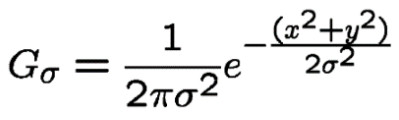
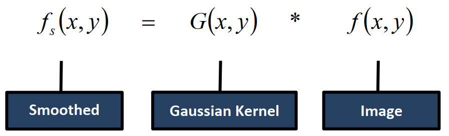
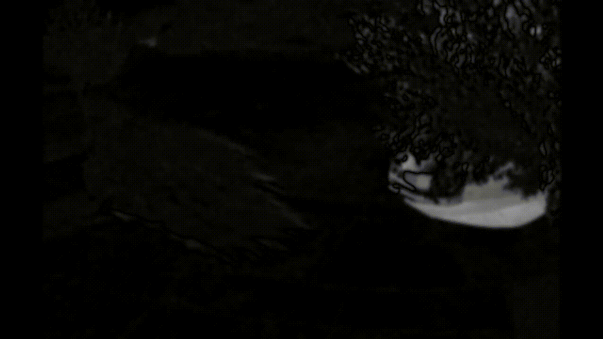

# Motion detection and tracking
## Introduction
Motion detection is the process of detecting a change in the position of an object relative to its surroundings or a change in the surroundings relative to an object. The background of our video stream is largely static and unchanging over consecutive frames of a video.  If we can model the background, we monitor it for substantial changes.
## Methodology
<p align="center">
  
  
</p>

### Step 1:
Background image is a baseline image. This image is used as a reference for detecting object. Frame difference is calculated between the reference image and the image having an object.

  
  
### Step 2:

The next step is conversion to grayscale and gaussian smoothing. It removes the noise from the image since noise can affect the edge detection results. The gaussian kernel is calculated using the formula: 

<p align="center">

</p>


Gaussian filter is convolved with the image to remove the noise and smoothened the image.

<p align="center">

</p>


### Step 3:

Frame difference detects moving objects by examining the difference of two adjacent frames.
Pixel Wise intensity difference.
In OpenCV:

``` #2x
Cv2.absdiff(reference, original)
```



### Step 04:

Next step is thresholding and dilation. In digital image processing, thresholding is the simplest method of segmenting images. From a grayscale image, thresholding can be used to create binary images. Dilation adds pixels to the boundaries of objects in an image.
In OpenCV:

```
Cv2.threshold(image, thresh_val, max_val, method)
```


Step 05:

Next step is finding Contours and Contours area. Contours can be explained simply as a curve joining all the continuous points (along the boundary), having same color or intensity. Contours are an outline representing or bounding the shape or form of something.
Contour Area -> Area Enclosed inside a closed contour in pixels


